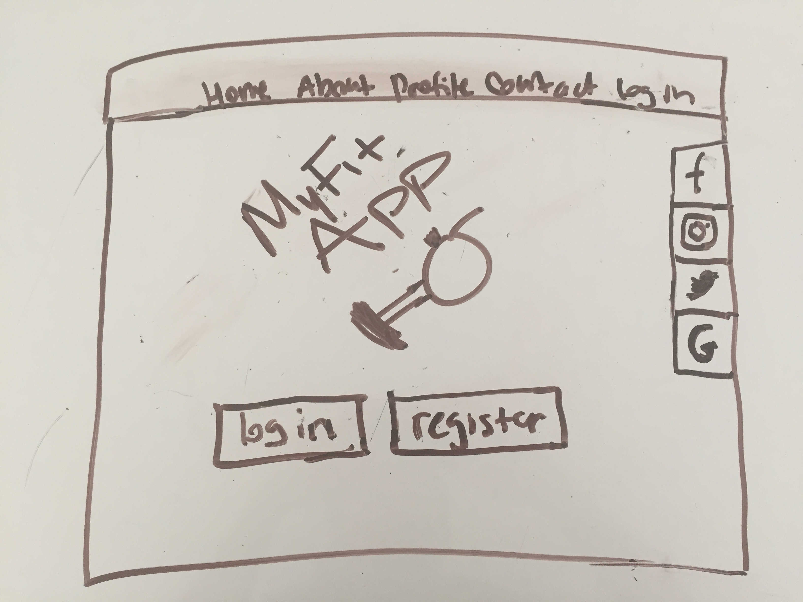
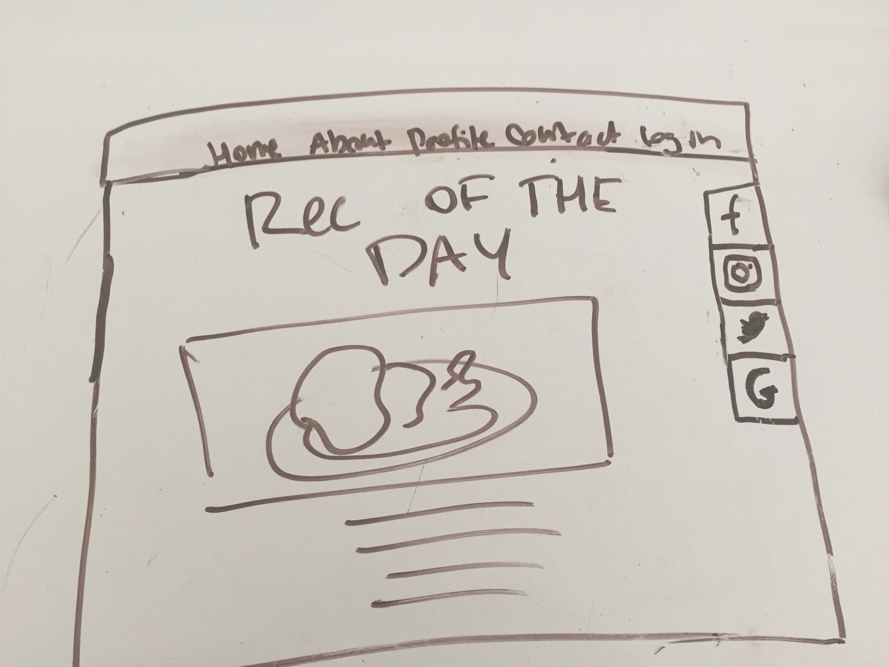
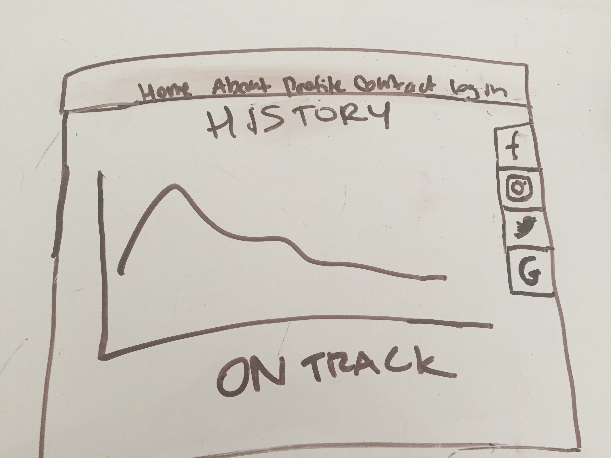
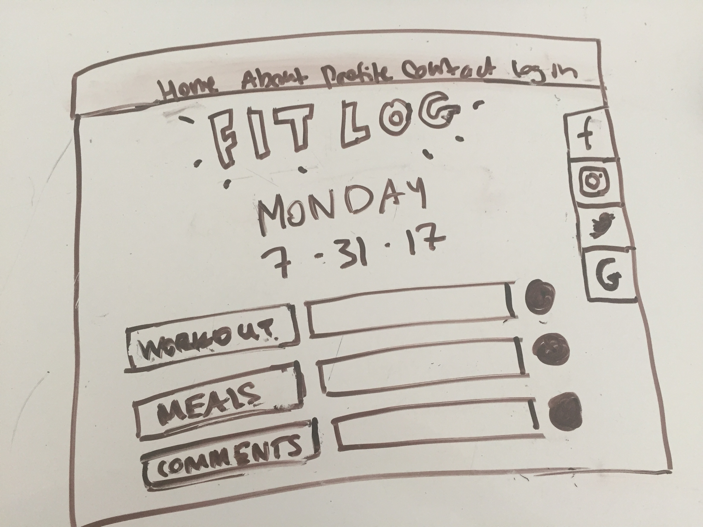
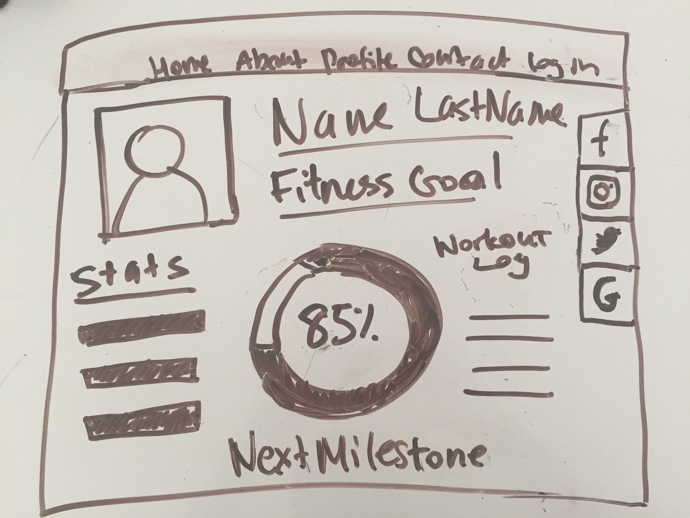

*** Franklin Lema  / 7/30 ***

# MyFitness App Proposal

           Im looking to create app that helps users log and access the progress towards their fitness goals.
        At registration users will chose from options such "gain muscle mass" or "burn fat". Based on these
        initial "goals" users will be given healthy meal recipe suggestions that corresponds with their
        fitness goal. For example, buring fat would require meals low on calories.
            Additionally, users will be able to log their exercise routine, type of workout, and related
        comments for each day. This data will be editable and  viweable in graph format.

## Wireframe

(Your wireframes go here. Preferably two or more)

## Initial thoughts on game structure

    SQL table samples
            CREATE TABLE IF NOT EXISTS todos (
            id SERIAL PRIMARY KEY,
            workout_time int,
            workout_type VARCHAR(50),
            comments VARCHAR(255)
            );
    
    
    
    
            CREATE TABLE IF NOT EXISTS users (
            id SERIAL PRIMARY KEY,
            username VARCHAR(255) UNIQUE NOT NULL,
            email VARCHAR(255) UNIQUE NOT NULL,
            password_digest TEXT NOT NULL,
            firstname VARCHAR(255),
            lastname VARCHAR(255)
            );

## Phases of Completion
    Planning:
        -Layout planning
        -code structure
        -select api
        -app approval
    Implimentation:
        -creating code
        -testing
        -revising
    Final Revison:
        -verify Api data
        -verify all functions (login, CRUD, return a recipe, view user logs)
        

## Links and Resources

(Anything you've looked up so far or are thinking about using.)

link to api: https://developer.edamam.com/
